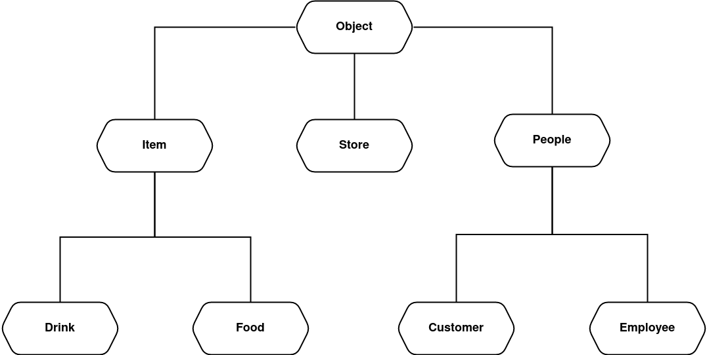

*Lab 4, OOP*

# Store Simulation

Declared Classes:
* Object
* Store
* People
* Customer
* Employee
* Item
* Food
* Drink

## Hierarchy Diagram

  

## Scenarios

1. The customer enters the store
2. Checks his balancce
3. He can go to: Main Section, Meat Section, Fish Section, Drink Section and Vending Machine 
4. Choose the items he wants
5. The item can be out of stock
6. The worker of Fish/Meat Section can be temporarily on a break
7. The customers goes to pay at the cashier
8. If he has 4 items, he receives a 10% discount 
9. There is a tiny possibility that the he trys to leave the store without paying
10. There is a possibility to be stopped by the Security Guard to control the cheque
11. If he has a cheque, he is free, if not, he must go to pay
12. The customers leaves the store
13. Once per simulation, a restock of items in the store can be done
